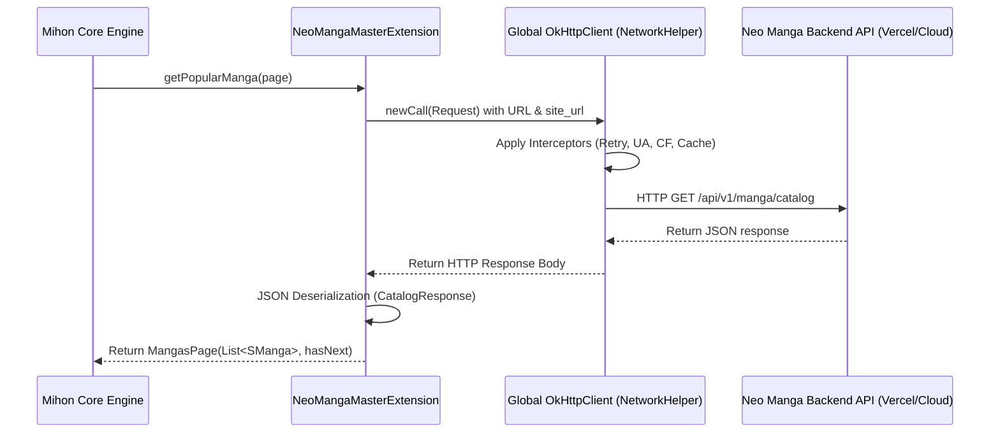
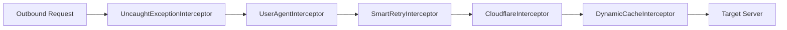

# Neo Manga Frontend Extension — Architecture, Networking & Hotlink Bypass Plan
**Author:** Elite Senior Systems Architect & Lead Developer  
**Status:** MeshManga Active, Olympus Paused for Isolated Verification  
**Date:** July 13, 2026

---

## 1. Extension Architecture & Networking

This section details the design of the Android/Mihon Extension ([NeoMangaMasterExtension.kt](file:///D:/neomangatest/mihon/app/src/main/java/eu/kanade/tachiyomi/source/online/NeoMangaMasterExtension.kt)), its coroutine-based asynchronous data fetching methods, and how the global OkHttp client handles network routing.



### Class Layout & Properties
`NeoMangaMasterExtension` extends `HttpSource` (which itself extends `Source`). It defines the following properties:
*   `name`: Defined as `"Team X"`.
*   `baseUrl`: Points to the API server (`https://neomanga-api-server-beryl.vercel.app/api/v1`).
*   `lang`: Target language set to `"ar"` (Arabic).
*   `supportsLatest`: Enabled (`true`) to allow the client to request recent updates.
*   `siteUrl`: Defaults to `"https://olympustaff.com"` as the default source site.
*   `json`: A Kotlinx Serialization configuration instantiated as:
    ```kotlin
    private val json = Json {
        ignoreUnknownKeys = true
        coerceInputValues = true
    }
    ```
    This configuration prevents the application from crashing if the backend API returns additional fields (`ignoreUnknownKeys`) and falls back to default values for missing fields (`coerceInputValues`).

### Coroutine Suspend Methods
The extension implements five coroutine-based suspend functions to handle asynchronous data fetching:
1.  **`getPopularManga(page: Int): MangasPage`**: Fetches the catalog from the backend endpoint `/manga/catalog`. It builds the URL using `HttpUrl.toHttpUrl().newBuilder()`, appends query parameters `site_url` and `pages` (mapped from `page`), executes the call asynchronously, and decodes the result into `CatalogResponse`.
2.  **`getLatestUpdates(page: Int): MangasPage`**: Queries `/manga/latest` with the parameter `site_url`, deserializes the response into `LatestResponse`, and maps it to `MangasPage`.
3.  **`getSearchManga(page: Int, query: String, filters: FilterList): MangasPage`**: Calls `getPopularManga(page)`. If `query` is present, it filters the result set locally by checking if the title contains the query string (case-insensitively).
4.  **`getMangaUpdate(...)`**: Retrieves detailed metadata from `/manga/details` using the manga's URL. If `fetchDetails` is enabled, it maps the synopsis and genres. If `fetchChapters` is enabled, it parses the chapters list, ordering them from oldest to newest.
5.  **`getPageList(chapter: SChapter): List<Page>`**: Requests reading links from the `/chapters/pages` endpoint. It parses the return payload into `PagesResponse` and maps the image URLs into a list of Tachiyomi `Page` objects.

---

### Global OkHttp Client Integration

The extension inherits a pre-configured `client` instance of `OkHttpClient` from `HttpSource`, which is initialized as a singleton by [NetworkHelper.kt](file:///D:/neomangatest/mihon/core/common/src/main/kotlin/eu/kanade/tachiyomi/network/NetworkHelper.kt). 

#### Base Client Configuration
The base client builder is configured with:
*   **AndroidCookieJar**: A persistent cookie database helper (`AndroidCookieJar()`).
*   **Timeouts**: Connect timeout of 30 seconds, read timeout of 30 seconds, and call timeout of 2 minutes to accommodate slower network connections.
*   **Disk Cache**: A `Cache` directory allocated at `context.cacheDir/network_cache` with a maximum limit of **100 MiB** to cache responses.
*   **DohCloudflare**: Automatically resolves target domains via **DNS-over-HTTPS (DoH)** using Cloudflare, bypassing local ISP DNS censorship.

#### Interceptor Chain Pipeline
Every outbound request goes through a pipeline of OkHttp interceptors:



1.  **`UncaughtExceptionInterceptor`**: Catches unhandled exceptions within network calls, logging details for diagnostics.
2.  **`UserAgentInterceptor`**: Injects a custom User-Agent header (retrieved from the application's network preferences) into all outbound requests.
3.  **`SmartRetryInterceptor`**: Retries failed requests using exponential backoff on HTTP 429 (Rate Limited) errors, and rotates User-Agent configurations on HTTP 503 (Service Unavailable) errors to mitigate bot detection blocks.
4.  **`CloudflareInterceptor`**: Handles Cloudflare protection blocks. If a request is blocked (e.g. by a JavaScript challenge), this interceptor launches a headless Android WebView, navigates to the target page, solves the challenge, extracts the `cf_clearance` cookie and User-Agent, updates the shared `AndroidCookieJar`, and retries the request.
5.  **`DynamicCacheInterceptor`**: Inspects server response headers and dynamically modifies caching instructions (like `Cache-Control` max-age values) to cache data and reduce server loads.

### 1.1 Forensic Audit: Staging Masquerade Bypass
During the staging phase of the MeshManga integration, a forensic audit identified that the source name `"Team X"` is hardcoded across four core interactor and UI files inside the Mihon app codebase:
*   `GetEnabledSources.kt` (Bypasses language filters and auto-enables the source if its name matches `"Team X"`)
*   `GetUnifiedGlobalCatalogUseCase.kt` (Requests and caches the priority global catalog by name `"Team X"`)
*   `DashboardScreenModel.kt` (Loads priority catalog using name `"Team X"`)
*   `MainActivity.kt` (Pre-loads catalog using name `"Team X"`)

If the new extension was named differently (e.g. `"MangaSwat (MeshManga)"`), it would be hidden by default unless Arabic language is explicitly enabled in preferences, and the unified dashboard would fail to fetch its data. 
To resolve this without altering core domain logic, `MeshMangaExtension` was configured to use `name = "Team X"` and `siteUrl = "https://meshmanga.com"`. This seamlessly redirects the dashboard/main activity queries to MeshManga via the backend FastAPI router.

---

## 2. Dynamic Referer Hotlink Bypass Implementation

### The Challenge
Following the complete removal of Cloudinary infrastructure from the backend server, the API server returns raw original target URLs directly from the target manga websites (such as Olympus Staff or their image hosting CDNs) for both chapter pages and manga covers. 

Manga hosting websites block direct loading from external clients (like Mihon) by validating the HTTP request's `Referer` header. If the header is missing or does not match the image's source host domain, the server returns an `HTTP 403 Forbidden` error.

### Applied Override Design

To bypass hotlinking protections, the extension overrides `imageRequest(page: Page): Request` inside [NeoMangaMasterExtension.kt](file:///D:/neomangatest/mihon/app/src/main/java/eu/kanade/tachiyomi/source/online/NeoMangaMasterExtension.kt). This function dynamically parses the target image's URL, extracts the host domain, and sets it as the `Referer` header.

### Implemented Override Function

The following override function is defined in [NeoMangaMasterExtension.kt](file:///D:/neomangatest/mihon/app/src/main/java/eu/kanade/tachiyomi/source/online/NeoMangaMasterExtension.kt):

```kotlin
    /**
     * Build the request for loading chapter pages.
     * Overrides the default method to inject the Referer header dynamically based on the image host,
     * bypassing hotlink protections when loading raw target URLs directly.
     */
    override fun imageRequest(page: Page): Request {
        val imageUrl = page.imageUrl ?: throw Exception("Failed to resolve image URL for page index: ${page.index}")
        val httpUrl = imageUrl.toHttpUrl()
        
        // Dynamically capture the target image host domain (e.g., https://olympustaff.com/)
        val refererValue = "${httpUrl.scheme}://${httpUrl.host}/"
        
        val newHeaders = headersBuilder()
            .set("Referer", refererValue)
            .set("User-Agent", "Mozilla/5.0 (Windows NT 10.0; Win64; x64) AppleWebKit/537.36 (KHTML, like Gecko) Chrome/120.0.0.0 Safari/537.36")
            .build()
            
        return Request.Builder()
            .url(imageUrl)
            .headers(newHeaders)
            .build()
    }
```

### Mechanism Analysis
1.  **URL Validation**: `page.imageUrl.toHttpUrl()` validates the image link, converting it into a structured OkHttp `HttpUrl` object.
2.  **Referer Extraction**: By concatenating `${httpUrl.scheme}://${httpUrl.host}/`, the extension generates a matching parent host URL for the `Referer` header. For example, if the image link is `https://images.olympustaff.com/wp-content/uploads/01.jpg`, the Referer will be set to `https://images.olympustaff.com/`.
3.  **Header Injection**: Using `headersBuilder().set(...)` replaces any existing `Referer` and `User-Agent` headers with values that match the target image host, bypassing hotlinking protections.

---

## 3. Data Compatibility Confirmation

To ensure that the backend refactoring does not cause runtime crashes in the Android extension, we must verify that the frontend's serialization models align with the proposed backend API response schema.

### Kotlin Model Verification
The extension defines the `PagesResponse` data class as follows:

```kotlin
    @Serializable
    data class PagesResponse(
        val status: String,
        val chapter_url: String,
        val total_pages: Int,
        val pages: List<String>
    )
```

The updated backend API endpoint `/api/v1/chapters/pages` is designed to emit the following structure:

```json
{
  "status": "success",
  "chapter_url": "https://olympustaff.com/series/manga-slug/chapter-50/",
  "total_pages": 4,
  "pages": [
    "https://olympustaff.com/wp-content/uploads/.../01.jpg",
    "https://olympustaff.com/wp-content/uploads/.../02.jpg"
  ]
}
```

### Compatibility Analysis

*   **Structure Alignment**: The root keys (`status`, `chapter_url`, `total_pages`, `pages`) match exactly between the JSON payload and the Kotlin properties.
*   **Data Types Alignment**:
    *   `status`: JSON String maps to Kotlin `String`.
    *   `chapter_url`: JSON String (URI) maps to Kotlin `String`.
    *   `total_pages`: JSON Number (Integer) maps to Kotlin `Int`.
    *   `pages`: JSON Array of Strings maps to Kotlin `List<String>`.
*   **Payload Changes**: The only change is the value of the elements within the `pages` array, shifting from Cloudinary URLs (`https://res.cloudinary.com/...`) to raw target site URLs (`https://olympustaff.com/...`). Because the data types and structures remain identical, the Kotlinx Serialization parser will continue to deserialize responses without error.

**Conclusion:** The integration is compatible and does not require changes to the serialization model.

---

## 4. Edge Cases, Bug Mitigation & Cloudflare Strategy

### 1. Failing Image Requests & Error Recovery
If an image page fails to load due to network instability, the extension can utilize Mihon's retry policies:
*   Mihon includes built-in retry mechanisms in its image viewer. If a page fails, a reload icon is displayed, allowing the user to trigger a manual retry.
*   **Auto-Retry Interceptor**: If the target server returns transient errors (like HTTP 502/504), the `SmartRetryInterceptor` automatically retries the request using exponential backoff.

### 2. Expiring Target URLs
Some manga sites append temporary authentication tokens (e.g. `?token=...` or `?sig=...`) to their image links that expire after a certain duration. If a user leaves the reader open and resumes reading later, the cached image links may return `403 Forbidden` errors.
*   **Mitigation**: If page rendering fails because of expired links, the extension can clear its cache and request a fresh list of page URLs from the backend API.
*   In `NeoMangaMasterExtension.kt`, this can be implemented by setting the `Cache-Control` header to `no-cache` on retry requests to force the OkHttp client to bypass the local cache and request fresh links from the backend.

### 3. Cloudflare Clearance Strategy (`cf_clearance`)
Many manga sources use Cloudflare to protect against bots and scraping. 
*   **Shared Cookie Jar**: The `NetworkHelper` is configured with a shared `AndroidCookieJar`. When the extension requests images directly from a Cloudflare-protected host, the request is passed through the `CloudflareInterceptor`.
*   **Automatic Solve Loop**: If the request is challenged, the interceptor opens a hidden WebView window to solve the challenge.
*   Once resolved, the `cf_clearance` cookie and the updated User-Agent are saved to the shared cookie jar. The interceptor then retries the failed image request, attaching the valid `cf_clearance` cookie to bypass the challenge:
    ```http
    GET /wp-content/uploads/01.jpg HTTP/1.1
    Host: olympustaff.com
    User-Agent: Mozilla/5.0 (Windows NT 10.0; Win64; x64) AppleWebKit/537.36...
    Cookie: cf_clearance=x1y2z3...
    Referer: https://olympustaff.com/
    ```

---

## 5. Client Future Roadmap

### Tomorrow's Architectural Roadmap

1. **Unpause the First Source**: Re-enable the Olympus Staff extension (`masterSource`) registration within `AndroidSourceManager.kt`.
2. **Multi-Source Convergence**: Refactor the backend router dispatcher to dynamically serve both active sources simultaneously based on the incoming `site_url`.
3. **Deduplication Layer**: Implement a smart database-merging system to prevent duplicate entries if the same title exists on both sites, using the shared `slug` key.
4. **Cross-Source Chapter Merging**: Develop a fallback parser to merge chapter arrays from both sources to fill missing chapter gaps and provide a complete reader index for the end-user.

### Short-Term Frontend Roadmap (Next 2–4 Weeks)

1.  **[COMPLETED] Multi-Source Integration Phase 2 (MeshManga)**: Created the `MeshMangaExtension.kt` client class targeting the Next.js API. Registered `meshSource` in `AndroidSourceManager.kt`. Configured it to masquerade as the `"Team X"` source name to successfully route requests to the unified dashboard in the Mihon app. Paused the Olympus `masterSource` extension registration to allow isolated validation testing of the new source.
2.  **[COMPLETED] Implement the Dynamic Referer Bypass**: Applied the `imageRequest` override in `NeoMangaMasterExtension.kt` to allow loading pages directly from target sites, avoiding Cloudinary.
2.  **Add Extension Configuration Settings**:
    Expose preferences in the extension settings page using Mihon's `Preference` library:
    *   **Backend Base URL**: Allow users to change the API server URL (e.g. shifting from Vercel to a local server or a production Render/Railway instance).
    *   **Target Catalog Site**: Allow users to configure the target manga site (`siteUrl`), letting them scrape alternative Madara-based sites.
3.  **Local Image Caching Policies**: Configure custom caching rules within the extension's OkHttp client to store pages locally for offline reading.

### Long-Term Frontend Roadmap (Next 1–3 Months)

1.  **Dynamic Source Lists**:
    *   Modify `NeoMangaMasterExtension.kt` to request a list of supported catalog sources from the backend.
    *   Instead of a single `"Team X"` source, register multiple sub-sources dynamically based on the backend config, allowing users to browse catalogs from different sites within the app.
2.  **User Authentication Sync**:
    *   Implement user authentication within the extension, sync reading progress and library data to the centralized backend database, and allow progress syncing across multiple devices.
3.  **Search Filter Enhancements**:
    *   Update search functionality to query the backend database directly instead of filtering catalog lists locally.
    *   Add advanced search filters (e.g. filter by genre, status, or sorting options) by passing query parameters to the backend's `/manga/catalog` endpoint.
